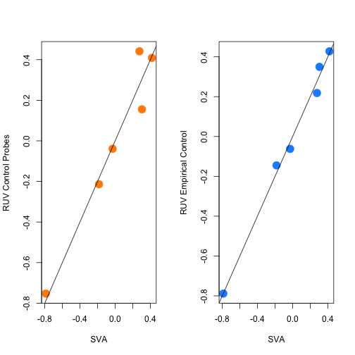
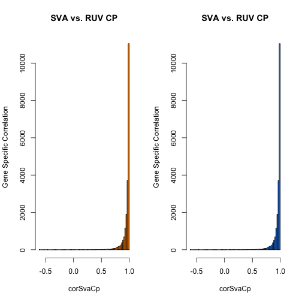
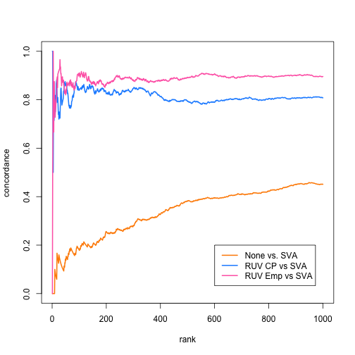

Quick Comparison of RUV and SVA for diagnostic purposes
========================================================


## Summary 

RUV and SVA are two methods for removing unknown/unwanted batch effects from RNA-seq data. In this analysis we show that: (1) SVA produces very similar estimates of unknown batch effects to both RUV with control probes and RUV with empirical control probes, (2) SVA produces very similar adjusted counts to the RUV approaches, and (3) SVA produces very similar DE results to the RUV approaches. This first analysis is based solely on the example data set in the RUVSeq vignette. 


### Install packages

This analysis depends on the current devel version of Bioconductor because the RUV package is only availabe in devel. See session information at the end of the comparison. This chunk of code is not set to be evaluated. If you want to rerun the code and ensure packages are installed, set `eval=TRUE` in the source code. 


```r
source("http://bioconductor.org/biocLite.R")
BiocInstaller::useDevel()
biocLite("sva")
biocLite("RUVSeq")
biocLite("zebrafishRNASeq",type="source")
install.packages("devtools")
library(devtools)
devtools::install_github('RSkittleBrewer', 'alyssafrazee')
install.packages("doRNG",type="source")
biocLite("ffpe")
```

Now load the libraries


```r
library(sva)
```

```
## Loading required package: corpcor
## Loading required package: mgcv
## Loading required package: nlme
## This is mgcv 1.7-29. For overview type 'help("mgcv-package")'.
```

```r
library(RUVSeq)
```

```
## Loading required package: EDASeq
## Loading required package: Biobase
## Loading required package: BiocGenerics
## Loading required package: parallel
## 
## Attaching package: 'BiocGenerics'
## 
## The following objects are masked from 'package:parallel':
## 
##     clusterApply, clusterApplyLB, clusterCall, clusterEvalQ,
##     clusterExport, clusterMap, parApply, parCapply, parLapply,
##     parLapplyLB, parRapply, parSapply, parSapplyLB
## 
## The following object is masked from 'package:stats':
## 
##     xtabs
## 
## The following objects are masked from 'package:base':
## 
##     anyDuplicated, append, as.data.frame, as.vector, cbind,
##     colnames, do.call, duplicated, eval, evalq, Filter, Find, get,
##     intersect, is.unsorted, lapply, Map, mapply, match, mget,
##     order, paste, pmax, pmax.int, pmin, pmin.int, Position, rank,
##     rbind, Reduce, rep.int, rownames, sapply, setdiff, sort,
##     table, tapply, union, unique, unlist
## 
## Welcome to Bioconductor
## 
##     Vignettes contain introductory material; view with
##     'browseVignettes()'. To cite Bioconductor, see
##     'citation("Biobase")', and for packages 'citation("pkgname")'.
## 
## Loading required package: ShortRead
## Loading required package: BiocParallel
## Loading required package: Biostrings
## Loading required package: S4Vectors
## Loading required package: IRanges
## 
## Attaching package: 'IRanges'
## 
## The following object is masked from 'package:nlme':
## 
##     collapse
## 
## Loading required package: XVector
## Loading required package: Rsamtools
## Loading required package: GenomeInfoDb
## Loading required package: GenomicRanges
## Loading required package: GenomicAlignments
## Loading required package: edgeR
## Loading required package: limma
## 
## Attaching package: 'limma'
## 
## The following object is masked from 'package:BiocGenerics':
## 
##     plotMA
```

```r
library(zebrafishRNASeq)
library(RSkittleBrewer)
library(ffpe)
```

```
## Loading required package: TTR
## Loading required package: xts
## Loading required package: zoo
## 
## Attaching package: 'zoo'
## 
## The following object is masked from 'package:Rsamtools':
## 
##     index
## 
## The following objects are masked from 'package:base':
## 
##     as.Date, as.Date.numeric
## 
## 
## Attaching package: 'xts'
## 
## The following objects are masked from 'package:GenomicAlignments':
## 
##     first, last
```

```
## Warning: replacing previous import by 'graphics::image' when loading
## 'methylumi'
```

```
## KernSmooth 2.23 loaded
## Copyright M. P. Wand 1997-2009
```

### Load and process the zebrafish data

The first comparison will be on the zebrafish data like those in the RUVSeq vignette. For the vignette code see this link http://bioconductor.org/packages/devel/bioc/vignettes/RUVSeq/inst/doc/RUVSeq.R.


```r
data(zfGenes)
filter <- apply(zfGenes, 1, function(x) length(x[x>5])>=2)
filtered <- zfGenes[filter,]
genes <- rownames(filtered)[grep("^ENS", rownames(filtered))]
spikes <- rownames(filtered)[grep("^ERCC", rownames(filtered))]
x <- as.factor(rep(c("Ctl", "Trt"), each=3))
set <- newSeqExpressionSet(as.matrix(filtered),
                           phenoData = data.frame(x, row.names=colnames(filtered)))
```


### Calculate RUV adjustment factors


```r
## RUV using the known spikeins
ruvCp <- RUVg(counts(set), spikes, k=1)

## RUV using control probes
design <- model.matrix(~x, data=pData(set))
y <- DGEList(counts=counts(set), group=x)
y <- calcNormFactors(y, method="upperquartile")
y <- estimateGLMCommonDisp(y, design)
y <- estimateGLMTagwiseDisp(y, design)

fit <- glmFit(y, design)
lrt <- glmLRT(fit, coef=2)

top <- topTags(lrt, n=nrow(set))$table
empirical <- rownames(set)[which(!(rownames(set) %in% rownames(top)[1:5000]))]
ruvEmp <- RUVg(counts(set), empirical, k=1)
```

### Calculate sva adjustment factors


```r
dat = log(as.matrix(filtered)+1)
mod = model.matrix(~rep(c(0,1),each=3))
mod0 = cbind(mod[,1])
sv1 = sva(dat,mod,mod0,n.sv=1)
```

```
## Number of significant surrogate variables is:  1 
## Iteration (out of 5 ):1  2  3  4  5
```


### Compare sva and ruv adjustment factors


```r
# Get colors
trop = RSkittleBrewer('tropical')

par(mfrow=c(1,2))
plot(sv1$sv,ruvCp$W,col=trop[1],
     pch=19,cex=2,xlab="SVA",ylab="RUV Control Probes")
abline(c(0,1))

plot(sv1$sv,ruvEmp$W,col=trop[2],
     pch=19,cex=2,xlab="SVA",ylab="RUV Empirical Control")
abline(c(0,1))
```

 

```r
cor(sv1$sv,ruvCp$W)
```

```
##        W_1
## [1,] 0.974
```

```r
cor(sv1$sv,ruvEmp$W)
```

```
##        W_1
## [1,] 0.996
```


### Compare adjusted values


```r
n = dim(filtered)[2]
Id  = diag(n)
modsv = cbind(sv1$sv)
resid = dat %*% (Id - modsv %*% solve(t(modsv) %*% modsv) %*% t(modsv))
svaCounts = round(exp(resid))

corSvaCp = corSvaEmp = rep(NA,dim(dat)[1])
for(i in 1:dim(dat)[1]){corSvaCp[i] = cor(svaCounts[i,],ruvCp$normalizedCounts[i,])}
for(i in 1:dim(dat)[1]){corSvaEmp[i] = cor(svaCounts[i,],ruvEmp$normalizedCounts[i,])}

par(mfrow=c(1,2))
hist(corSvaCp,ylab="Gene Specific Correlation",main="SVA vs. RUV CP",col=trop[1],breaks=100)
hist(corSvaCp,ylab="Gene Specific Correlation",main="SVA vs. RUV CP",col=trop[2],breaks=100)
```

 

```r
quantile(corSvaCp,probs=seq(0,1,length=20))
```

```
##      0%  5.263%  10.53%  15.79%  21.05%  26.32%  31.58%  36.84%  42.11% 
## -0.6009  0.8287  0.8938  0.9249  0.9423  0.9548  0.9637  0.9704  0.9758 
##  47.37%  52.63%  57.89%  63.16%  68.42%  73.68%  78.95%  84.21%  89.47% 
##  0.9803  0.9843  0.9877  0.9905  0.9930  0.9949  0.9966  0.9980  0.9990 
##  94.74%    100% 
##  0.9997  1.0000
```

```r
quantile(corSvaEmp,probs=seq(0,1,length=20))
```

```
##       0%   5.263%   10.53%   15.79%   21.05%   26.32%   31.58%   36.84% 
## -0.01717  0.96958  0.98170  0.98727  0.99051  0.99259  0.99404  0.99514 
##   42.11%   47.37%   52.63%   57.89%   63.16%   68.42%   73.68%   78.95% 
##  0.99601  0.99673  0.99731  0.99781  0.99827  0.99866  0.99901  0.99931 
##   84.21%   89.47%   94.74%     100% 
##  0.99958  0.99978  0.99993  1.00000
```

### Calculate DE results for the three approaches


```r
###
## Calculate DE results for Control Probes RUV
###

design <- model.matrix(~x, data=pData(set))
y <- DGEList(counts=ruvCp$normalizedCounts, group=x)
y <- calcNormFactors(y, method="upperquartile")
y <- estimateGLMCommonDisp(y, design)
y <- estimateGLMTagwiseDisp(y, design)

fit <- glmFit(y, design)
lrt <- glmLRT(fit, coef=2)

cpResults <- lrt$table

###
## Calculate DE results for Empirical Control Probes RUV
###

design <- model.matrix(~x, data=pData(set))
y <- DGEList(counts=ruvEmp$normalizedCounts, group=x)
y <- calcNormFactors(y, method="upperquartile")
y <- estimateGLMCommonDisp(y, design)
y <- estimateGLMTagwiseDisp(y, design)

fit <- glmFit(y, design)
lrt <- glmLRT(fit, coef=2)

empResults <- lrt$table


###
## Calculate DE results for sva
###

design <- model.matrix(~x, data=pData(set))
y <- DGEList(counts=svaCounts, group=x)
y <- calcNormFactors(y, method="upperquartile")
y <- estimateGLMCommonDisp(y, design)
y <- estimateGLMTagwiseDisp(y, design)

fit <- glmFit(y, design)
lrt <- glmLRT(fit, coef=2)

svaResults = lrt$table


###
## Calculate DE results for no normalization
###

design <- model.matrix(~x, data=pData(set))
y <- DGEList(counts=filtered, group=x)
y <- calcNormFactors(y, method="upperquartile")
y <- estimateGLMCommonDisp(y, design)
y <- estimateGLMTagwiseDisp(y, design)

fit <- glmFit(y, design)
lrt <- glmLRT(fit, coef=2)

noneResults = lrt$table
```

### Compare results for the three approaches

Make concordance at the top plots to compare DE results from the three approaches. 


```r
empLr = empResults$LR
names(empLr) = rownames(empResults)
cpLr = cpResults$LR
names(cpLr) = rownames(cpResults)
svaLr = svaResults$LR
names(svaLr) = rownames(svaResults)
noneLr = noneResults$LR
names(noneLr) = rownames(noneResults)

none_sva = CATplot(-noneLr,-svaLr,maxrank=1000,make.plot=F)
ruv_cp_sva = CATplot(-cpLr,-svaLr,maxrank=1000,make.plot=F)
ruv_emp_sva = CATplot(-empLr,-svaLr,maxrank=1000,make.plot=F)

plot(none_sva,ylim=c(0,1),col=trop[1],lwd=2,type="l")
lines(ruv_cp_sva,ylim=c(0,1),col=trop[2],lwd=2)
lines(ruv_emp_sva,ylim=c(0,1),col=trop[3],lwd=2)
legend(600,0.2,legend=c("None vs. SVA","RUV CP vs SVA","RUV Emp vs SVA"),col=trop[1:3],lwd=2)
```

 


### Timing comparison


```r
empruv <- function(){
  y <- DGEList(counts=counts(set), group=x)
  y <- calcNormFactors(y, method="upperquartile")
  y <- estimateGLMCommonDisp(y, design)
  y <- estimateGLMTagwiseDisp(y, design)
  
  fit <- glmFit(y, design)
  lrt <- glmLRT(fit, coef=2)

  top <- topTags(lrt, n=nrow(set))$table
  empirical <- rownames(set)[which(!(rownames(set) %in% rownames(top)[1:5000]))]
  ruvEmp <- RUVg(counts(set), empirical, k=1) 
}

system.time(sva(dat,mod,mod0,n.sv=1))
```

```
## Number of significant surrogate variables is:  1 
## Iteration (out of 5 ):1  2  3  4  5
```

```
##    user  system elapsed 
##   0.359   0.044   0.404
```

```r
system.time(RUVg(counts(set), spikes, k=1))
```

```
##    user  system elapsed 
##   1.475   0.004   1.479
```

```r
system.time(empruv())
```

```
##    user  system elapsed 
##   3.580   0.158   3.739
```


### Session Info


```r
sessionInfo()
```

```
## R version 3.1.0 (2014-04-10)
## Platform: x86_64-apple-darwin10.8.0 (64-bit)
## 
## locale:
## [1] en_US.UTF-8/en_US.UTF-8/en_US.UTF-8/C/en_US.UTF-8/en_US.UTF-8
## 
## attached base packages:
## [1] parallel  stats     graphics  grDevices utils     datasets  methods  
## [8] base     
## 
## other attached packages:
##  [1] ffpe_1.9.0               TTR_0.22-0              
##  [3] xts_0.9-7                zoo_1.7-11              
##  [5] RSkittleBrewer_1.1       zebrafishRNASeq_0.99.2  
##  [7] RUVSeq_0.99.2            edgeR_3.7.1             
##  [9] limma_3.21.4             EDASeq_1.99.1           
## [11] ShortRead_1.23.11        GenomicAlignments_1.1.11
## [13] Rsamtools_1.17.16        GenomicRanges_1.17.17   
## [15] GenomeInfoDb_1.1.6       Biostrings_2.33.9       
## [17] XVector_0.5.6            IRanges_1.99.15         
## [19] S4Vectors_0.0.7          BiocParallel_0.7.2      
## [21] Biobase_2.25.0           BiocGenerics_0.11.2     
## [23] sva_3.11.0               mgcv_1.7-29             
## [25] nlme_3.1-117             corpcor_1.6.6           
## [27] knitr_1.6               
## 
## loaded via a namespace (and not attached):
##  [1] affy_1.43.2            affyio_1.33.0          annotate_1.43.4       
##  [4] AnnotationDbi_1.27.7   aroma.light_2.1.0      base64_1.1            
##  [7] BatchJobs_1.2          BBmisc_1.6             beanplot_1.1          
## [10] BiocInstaller_1.15.5   biomaRt_2.21.0         bitops_1.0-6          
## [13] brew_1.0-6             BSgenome_1.33.8        bumphunter_1.5.3      
## [16] codetools_0.2-8        colorspace_1.2-4       DBI_0.2-7             
## [19] DESeq_1.17.0           digest_0.6.4           doRNG_1.6             
## [22] evaluate_0.5.5         fail_1.2               foreach_1.4.2         
## [25] formatR_0.10           genefilter_1.47.5      geneplotter_1.43.0    
## [28] GenomicFeatures_1.17.9 grid_3.1.0             hwriter_1.3           
## [31] illuminaio_0.7.0       iterators_1.0.7        KernSmooth_2.23-12    
## [34] lattice_0.20-29        latticeExtra_0.6-26    locfit_1.5-9.1        
## [37] lumi_2.17.0            MASS_7.3-33            Matrix_1.1-3          
## [40] matrixStats_0.8.14     mclust_4.3             methylumi_2.11.1      
## [43] minfi_1.11.7           multtest_2.21.0        nleqslv_2.1.1         
## [46] nor1mix_1.1-4          pkgmaker_0.22          plyr_1.8.1            
## [49] preprocessCore_1.27.0  R.methodsS3_1.6.1      R.oo_1.18.0           
## [52] RColorBrewer_1.0-5     Rcpp_0.11.1            RCurl_1.95-4.1        
## [55] registry_0.2           reshape_0.8.5          rngtools_1.2.4        
## [58] RSQLite_0.11.4         rtracklayer_1.25.9     sendmailR_1.1-2       
## [61] sfsmisc_1.0-25         siggenes_1.39.0        splines_3.1.0         
## [64] stats4_3.1.0           stringr_0.6.2          survival_2.37-7       
## [67] tools_3.1.0            XML_3.98-1.1           xtable_1.7-3          
## [70] zlibbioc_1.11.1
```


